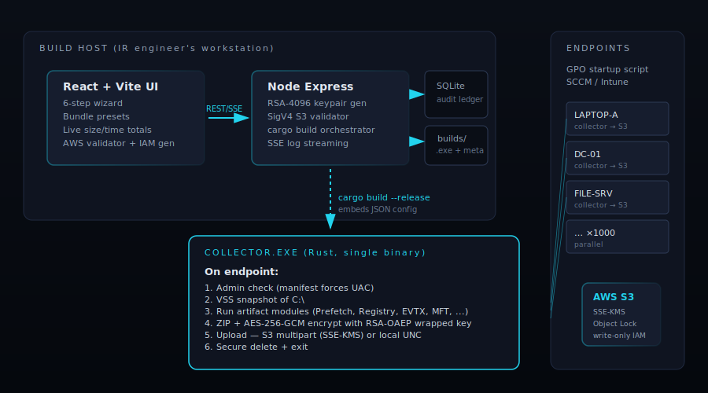

# DFIR Agent Builder

> DFIR triage collector compiler — a desktop wizard that builds a single, self-contained Rust collector binary with AWS S3 / KMS write-only uploads. Built for mass GPO deployment.



## What this is

An IR engineering tool that lets a team:

1. **Visually pick** which forensic artifacts to acquire (Prefetch, Amcache, Registry hives, EVTX, MFT, Memory dump, KAPE-style targets, browser, cloud, persistence — see the YAML catalog under [`artifacts/`](artifacts/)).
2. **Configure where evidence lands** — AWS S3 (multipart, SSE-KMS, write-only IAM; AWS or any S3-compatible endpoint like MinIO) or a local/UNC path **you specify** (no hardcoded default; env vars such as `%USERPROFILE%` / `%TEMP%` resolve per-endpoint so one build works across machines with different usernames).
3. **Click Build** and get a single hardened `Collector.exe` whose embedded config has the artifact list, encryption keys, and upload credentials baked in at compile time.
4. **Push the EXE** through GPO startup script / SCCM / Intune to thousands of endpoints. It runs once, drops triage into S3, and exits.

It is a clean-room reimplementation of Velociraptor's "Offline Collector Builder" idea, with three deliberate differences:

|                       | Velociraptor                                                  | This tool |
|-----------------------|---------------------------------------------------------------|-----------|
| Embed model           | Patches a YAML blob into a reserved 80KB section of a prebuilt binary | Each build is a fresh Rust compilation with config baked in via `include_bytes!` — **no size limit, no signature mismatch** |
| Detection footprint   | Endpoints see a known Velociraptor binary signature           | Each build is a unique binary; no shared static signatures |
| Runtime dependency    | Requires the Velociraptor binary on the build host            | Pure Rust desktop app, no Node/Python/npm/Docker |
| Encryption            | X509 / PGP wrapping                                           | Same hybrid scheme: RSA-OAEP-SHA256 wraps a per-run AES-256-GCM key |

Velociraptor is excellent and battle-tested — this tool stands on its shoulders. See [`docs/research-summary.md`](docs/research-summary.md) for the full design rationale.

## Architecture

```
┌──────────────────────┐    in-process calls    ┌──────────────────────┐    cargo build    ┌────────────────────┐
│  egui desktop wizard │ ──────────────────────▶│  Rust backend        │ ─────────────────▶│  Rust Collector    │
│  (single .exe)       │                        │  (same process)      │  embeds JSON cfg  │  → Collector.exe   │
└──────────────────────┘                        └──────────────────────┘                   └────────────────────┘
                                                          │
                                                          ▼ rusqlite
                                                ┌──────────────────────┐
                                                │  Audit ledger        │
                                                │  (no secrets)        │
                                                └──────────────────────┘
```

**One Cargo workspace, three crates:**

- **[`crates/builder-app/`](crates/builder-app/)** — `eframe` + `egui` desktop wizard. Opens a native window, walks the user through 6 steps, generates RSA-4096 keypairs in-process, validates S3 with a sentinel PutObject, spawns `cargo build` against the collector, streams the cargo log live into the UI via `std::sync::mpsc`. Records every build to a SQLite audit ledger.
- **[`crates/shared-crypto/`](crates/shared-crypto/)** — Code shared between the builder (encryption side) and the collector (decryption side). The credential vault lives here so both ends use one bit-compatible implementation.
- **[`collector/`](collector/)** — Rust binary. Single-shot; drops triage to S3 or a configurable local/UNC path. ~2.5 MB stripped release binary. **Statically links the MSVC C runtime (`+crt-static`, see [`.cargo/config.toml`](.cargo/config.toml)) so it runs on a clean Windows endpoint with no Visual C++ Redistributable — truly no prerequisites on the target.** Decrypts its embedded credentials via the shared `shared-crypto` vault.

There is **no HTTP server, no localhost, no Node, no npm.** The builder is one ~10 MB binary that opens a native window. File dialogs use [`rfd`](https://crates.io/crates/rfd) (Rusty File Dialog — native OS picker on Windows/Linux/macOS). In-memory AES keys are zeroed after use via [`zeroize`](https://crates.io/crates/zeroize).

## Quick start (dev)

Prerequisites:
- Rust stable (1.73+ — bundled `rust-lld`).
- On Windows: **MSVC build tools** (the C++ workload) — Rust needs `link.exe`. Install via Visual Studio Build Tools 2022, custom location is fine.

```powershell
# From the workspace root:
cargo run -p builder-app
```

That's it. A native window opens with the 6-step wizard. No browser, no port, no separate processes.

### Iterating during development

```powershell
# Auto-rebuild + relaunch on save:
cargo install cargo-watch
cargo watch -x 'run -p builder-app'
```

Wizard state is persisted to `.dev-state.json` in the project root every time it changes, so closing and reopening the window leaves you exactly where you were. Delete that file to start fresh.

### Running the tests

```powershell
cargo test
```

This runs:
- `shared-crypto`: credential vault roundtrip + HMAC verification + wrong-key rejection.
- `builder-app`: IAM policy generator (with/without KMS).

The collector has its own crate-level tests (run `cargo test -p dfir-collector`).

### Production build

```powershell
cargo build --release -p builder-app
```

Output: `target/release/builder-app.exe` (~5 MB stripped). Copy this single file to any Windows machine with the MSVC + Rust toolchain installed. That's the entire shippable artifact.

## Collector lifecycle

Each `Collector.exe`, when run on an endpoint, performs:

1. Verify it has admin token (manifest forces UAC; runtime check is defence in depth).
2. Parse embedded JSON config (compiled in — not on disk).
3. **Decrypt the AWS credential vault** using the build_id+timestamp-derived key.
4. Create scratch dir under `%TEMP%\dfir-<id>\`.
5. **Take a VSS snapshot of C:\\** (Windows) so locked Registry hives and EVTX are readable.
6. Run each enabled artifact module — driven by the YAML `embedded_sources` map written at build time:
   - `file_pattern` artifacts → glob from VSS root, copy to scratch.
   - `command` artifacts → shell out to native tools (`netstat`, `tasklist`, `wevtutil`, `systemctl`) and capture stdout/stderr.
   - `registry` artifacts → `reg save` per hive.
   - `raw_ntfs` artifacts → direct volume read via the bundled NTFS parser (for `$MFT`, `$LogFile`, `$UsnJrnl:$J`).
7. Pack scratch into a ZIP container (DEFLATE). Collection runs the artifacts in parallel (`concurrency`) and stops early if the optional `max_collection_size_gb` cap is reached.
8. **Encrypt** the ZIP into the chunked container (see [format](#encrypted-container-format)): per-chunk AES-256-GCM, the key wrapped with RSA-OAEP-SHA256 — streamed in constant memory regardless of size.
9. **Upload** to S3 (PutObject ≤100MB, multipart for larger) with SSE-KMS — virtual-hosted for AWS, path-style for custom endpoints (MinIO/Ceph) — or copy to the configured local/UNC path (env vars like `%USERPROFILE%`/`%TEMP%` are expanded on the endpoint). **Transient/network failures retry indefinitely with capped backoff** (a network outage pauses the upload rather than failing it); an interrupted multipart upload is **resumable** — a re-run finishes it, skipping parts already accepted.
10. Securely overwrite + delete plaintext zip and scratch.
11. Exit with code 0 on success, 1 on any unrecoverable failure.

Total runtime: 5-15 min for QuickTriage; 30-60 min for SANS Triage; 1-4 hr for Deep Dive.

## Bundle presets

| Preset | Artifacts | Time | Size |
|--------|-----------|------|------|
| **Quick Triage** | Execution evidence + live network + EVTX (last 7d) + persistence | 5-15 min | ~200 MB |
| **SANS / KAPE Triage** | + Full Registry + all EVTX + browser + jump lists + RDP cache | 30-60 min | 1-3 GB |
| **Deep Dive** | + Full MFT/USN + RAM dump + Outlook OST/PST + Teams | 1-4 hr | 5-20 GB |
| **Threat Hunt** | Targeted: live net + persistence + Sysmon + PowerShell | 15-30 min | ~500 MB |
| **Linux Quick / Full / Threat Hunt** | Mirror of Windows bundles for Linux endpoints | — | — |

Defined in [`artifacts/bundles.yaml`](artifacts/bundles.yaml). Add your own by editing that file — the wizard picks them up on next launch.

## Custom artifacts

Drop a `.yaml` file in `artifacts/custom/` (template: [`artifacts/custom/TEMPLATE.yaml`](artifacts/custom/TEMPLATE.yaml)). The catalog loader picks it up automatically on next launch.

Schema reference: [`artifacts/schema.yaml`](artifacts/schema.yaml).

## Performance & resource controls (Step 5)

Configured in the wizard and enforced by the collector at runtime on the endpoint:

| Control | Effect on the endpoint |
|---------|------------------------|
| **CPU limit %** | Caps CPU usage via a Windows **Job Object** hard rate-limit (falls back to a lower process priority class; `nice` on Linux). `0` = unthrottled. |
| **Concurrency** | Collects artifacts across N worker threads in parallel; results are still recorded in catalog order. `1` = sequential. |
| **Max collection size (GB)** | Stops collecting once the running total crosses the cap — enforced **mid-artifact** (per file), so a single huge glob (e.g. `$Recycle.Bin`) can't balloon the archive. `0` = no cap. |
| **Encryption chunk size** | Plaintext bytes sealed per chunk: a fixed value (MiB) **or Auto**, which sizes from the endpoint's available RAM (64–512 MiB). Bounds peak memory (~3× the chunk). |
| **Progress timeout (s)** | A watchdog aborts a collection that makes no progress for this long (a stuck artifact). It first releases the VSS snapshot and wipes the plaintext scratch so a stall leaves nothing behind. Guards collection only — never the upload. |
| **Output format** | `jsonl` (default) or `csv` — when `csv`, a `run_report.csv` is written alongside the JSON report inside the archive. |
| **Silent mode** | Detaches the console (`FreeConsole`) so nothing is shown on the endpoint; file logging continues. |

## AWS production setup

The IR engineer creates **once**, then every build references these:

1. **Dedicated forensics AWS account** (separate from prod).
2. **S3 bucket** with: versioning ON, Object Lock COMPLIANCE mode (365-day retention), SSE-KMS with CMK, deny non-HTTPS, deny `DeleteObject` from everyone (incl. root), CloudTrail logging.
3. **KMS Customer Managed Key** (multi-region if collecting across regions). Annual rotation. Separate "key admin" vs "key user" identities.
4. **Per-build IAM user** named `dfir-collector-<build-id>`, **write-only** policy from the wizard's Step 3 (the policy JSON is shown as you type the bucket). Access key 90-day expiry. Tag with build metadata.
5. **Read-only IR analyst role** (assumed via SSO + MFA) with `s3:GetObject`, `kms:Decrypt`. Source-IP-restricted to corporate VPN.

See [`docs/aws-setup.md`](docs/aws-setup.md) for the full walkthrough.

## GPO deployment

Two deployment patterns:

**1. Startup script (recommended)** — runs as `NT AUTHORITY\SYSTEM`, satisfying the admin requirement automatically:

```powershell
# In Group Policy Management:
# Computer Configuration → Policies → Windows Settings → Scripts → Startup
# Add Script: \\fileserver\IRTools\Collector_a3f9b221.exe
```

**2. SCCM / Intune** — wrap as a Win32 app with a registry-key detection rule (the collector writes `HKLM\Software\DFIR\LastRun` on completion).

The collector's `silent` mode (default) suppresses all UI; the only artifact left on the endpoint after a successful run is the log entry in `%TEMP%\dfir-collector-fatal.log` (only on failure) and the registry detection key.

## Encrypted container format

The container is **chunked (format version 2)**: the archive is encrypted in
independent AES-256-GCM chunks, so a collection of any size encrypts and decrypts in
**constant memory** — the archive is never loaded whole into RAM.

```
+--------------+----------+-----------------+-------------------+
| "DFIR" (4 B) | ver (1B) | hdr_len (4B BE) | header_json (N B) |
+--------------+----------+-----------------+-------------------+
then, repeated until EOF, one record per chunk:
+----------------------+------------------------------+
| chunk_len (4B BE u32)| AES-256-GCM chunk + 16B tag  |
+----------------------+------------------------------+
```

For chunk `i`: the nonce is `nonce_base` (8 B, in `header.nonce_b64`) ‖ `i` as 4-byte
big-endian, and the AAD is `header_json` ‖ `i` (4 B BE) ‖ a 1-byte last-chunk flag. Binding
the index + last-flag into the AAD makes reordering, dropping, or **truncating** chunks fail
authentication — a partial/interrupted upload can't be silently decrypted as if complete.
The chunk size is set on Step 5 — a fixed size in MiB, or Auto, which sizes it from the
endpoint's available RAM. Legacy version-1 (single-shot) containers are still decryptable.
See [`docs/decrypt.md`](docs/decrypt.md) for the analyst-side helper (handles both v2 and v1).

## Credential vault format

AWS access keys are not stored plaintext in the binary. At build time the builder encrypts them into a vault blob:

```
[8B  "DFIRV001" marker]
[12B AES-GCM nonce]
[8B  frag1]  ┐
[8B  frag2]  │  AES-256 key, split into 4 fragments,
[8B  frag3]  │  each XOR'd with sha256(build_id : build_timestamp)[..8]
[8B  frag4]  ┘
[ciphertext + 16B AES-GCM tag]
```

A separate HMAC-SHA256 (key = `build_id`) is stored alongside for tamper detection. At runtime the collector reverses the derivation and decrypts. This is defense in depth on top of the write-only IAM policy — the IAM policy is the real security boundary; the vault just raises the bar against automated credential scanners (`strings`, truffleHog, gitleaks).

Implementation: [`crates/shared-crypto/src/credential_vault.rs`](crates/shared-crypto/src/credential_vault.rs).

## Repo layout

```
IR_Agent_builder/
├── Cargo.toml                              ← workspace manifest
├── crates/
│   ├── builder-app/                        ← desktop wizard (egui)
│   │   └── src/
│   │       ├── main.rs                     ← eframe entry
│   │       ├── app.rs                      ← App state, frame loop
│   │       ├── spec.rs                     ← BuildSpec
│   │       ├── backend/
│   │       │   ├── artifact_catalog.rs     ← YAML loader
│   │       │   ├── aws.rs                  ← IAM policy + S3 validate
│   │       │   ├── build.rs                ← cargo build orchestrator
│   │       │   ├── embedded_config.rs      ← shape of the JSON written to collector
│   │       │   ├── keypair.rs              ← RSA-4096 generation
│   │       │   ├── ledger.rs               ← rusqlite audit log
│   │       │   └── sigv4.rs                ← AWS Signature v4 signer
│   │       └── ui/
│   │           ├── sidebar.rs              ← left stepper nav + profile card + export
│   │           ├── header.rs               ← top bar
│   │           ├── footer.rs               ← back/next buttons + validation gate
│   │           ├── theme.rs                ← dark cyan palette
│   │           ├── widgets.rs              ← step_header, section_label helpers
│   │           ├── step1_target.rs         ← OS / site / filename
│   │           ├── step2_artifacts.rs      ← artifact picker + bundle presets
│   │           ├── step3_upload.rs         ← S3 / local config + live validation
│   │           ├── step4_encryption.rs     ← RSA-4096 keygen + key display
│   │           ├── step5_performance.rs    ← tuning & limits
│   │           └── step6_review.rs         ← build log, actions, download
│   │
│   └── shared-crypto/                      ← used by builder + collector
│       └── src/
│           ├── lib.rs
│           └── credential_vault.rs         ← AES-GCM + XOR fragments
│
├── collector/                              ← Rust collector (single-binary EXE)
│   ├── Cargo.toml
│   ├── build.rs                            ← embeds admin manifest into PE
│   └── src/
│       ├── main.rs                         ← lifecycle (admin → VSS → artifacts → encrypt → upload)
│       ├── config.rs                       ← embedded config struct
│       ├── credential_vault.rs             ← decrypt side
│       ├── artifacts/                      ← per-platform dispatchers
│       ├── crypto/                         ← AES-GCM + RSA-OAEP hybrid
│       ├── upload/                         ← S3 multipart + chunked streaming
│       └── vss/                            ← Volume Shadow Copy creation
│
├── artifacts/                              ← YAML artifact definitions
│   ├── schema.yaml                         ← format spec
│   ├── bundles.yaml                        ← preset bundles
│   ├── custom/TEMPLATE.yaml                ← starting point for custom defs
│   ├── windows/<category>/*.yaml
│   └── linux/<category>/*.yaml
│
├── docs/
│   ├── architecture.svg
│   ├── aws-setup.md
│   ├── decrypt.md
│   └── research-summary.md
│
└── builds/                                 ← per-build output (gitignored)
    ├── ledger.sqlite                       ← audit log
    └── <build-id>/
        ├── Collector_<short>.exe
        └── build_metadata.json
```

## Troubleshooting

The collector logs verbosely to `%TEMP%\dfir-collector-<build-id8>.log` on the
endpoint (and a fatal log to `%TEMP%\dfir-collector-fatal.log` on failure). Every
run starts with a `[startup] profile: ...` line and ends with a `[summary] ...`
line; ZIP creation is logged as `[zip] added N files` → `[zip] OK: <path> exists, <bytes>`.

**"The agent ran but produced no ZIP / collected nothing":**
- **Not elevated.** Builds default to `require_admin = true`; a non-elevated run
  aborts *before* collection with `ABORTING BEFORE COLLECTION: not elevated...` in
  the log. Run as Administrator, or disable `require_admin` on Step 5.
- **Binary won't launch on a clean endpoint.** Older builds depended on the VC++
  runtime. Current builds statically link the CRT (`+crt-static`) — rebuild from
  `main` so the EXE is self-contained.
- **Check the log first** — the `[startup]`/`[zip]`/`[summary]` lines (or the fatal
  log) say exactly where it stopped.

**"Local output went nowhere":** the output path is required and has no default.
Set it on Step 3 (env vars like `%USERPROFILE%` are expanded on the endpoint); the
log shows `[local] resolved output path: '<raw>' -> '<expanded>'` and `[local] wrote ...`.

## Beyond Velociraptor — what's next

- **Code signing pipeline** — AzureSignTool integration for EV cert signing of every build.
- **Native artifact parsers** — direct `parse_evtx`, `parse_prefetch`, `parse_mft` instead of raw file copy (smaller container, faster analyst workflow).
- **AWS Transfer Family SFTP option** — embeds an SSH private key instead of AWS access key, eliminating credential exposure entirely.
- **STS temporary credentials** — replace static IAM keys with short-lived STS tokens via an internal credential broker.
- **Configurable EDR exclusion path** — reads `HKLM\Software\DFIR\ExclusionPath` at runtime so the build doesn't need to know it.
- **Differential collection** — `Collector --since 2026-04-01` for follow-up acquisitions.
- **In-process memory acquisition** — drop the `winpmem.exe` sidecar; use a kernel driver compiled into a separate signed `.sys`.

## Security caveats (read this)

- Embedded AWS keys can be extracted from any binary. The IAM policy must be **write-only**, scoped by `${aws:username}` prefix, and the bucket must have Object Lock so even a stolen key cannot tamper with collected evidence. See [`crates/builder-app/src/backend/aws.rs`](crates/builder-app/src/backend/aws.rs) `generate_iam_policy()`.
- The X509 private key from Step 4 is generated in-process, displayed once, and **not persisted** to disk. If you lose it, every collection from that build is unrecoverable. Push it into AWS Secrets Manager / HashiCorp Vault immediately. The wizard explicitly tells you so on Step 4.
- VSS snapshots take a few seconds. Production servers under heavy I/O may briefly stall — schedule via GPO for off-hours where possible.
- Memory dumps require `winpmem.exe` alongside the collector and a kernel driver load. Some EDRs flag this — code-sign the collector and add to the AV exclusion list.
